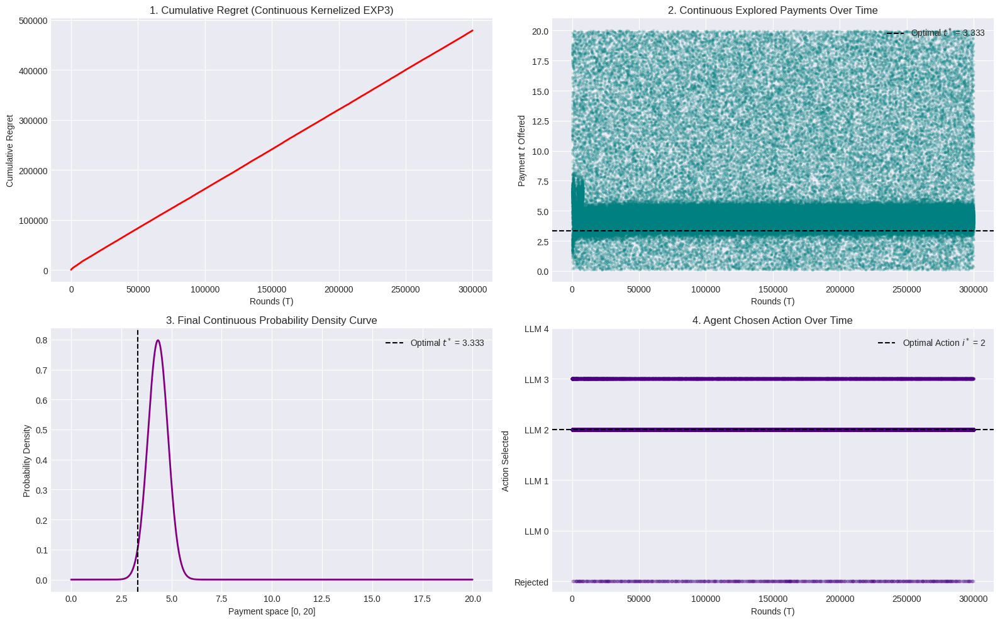
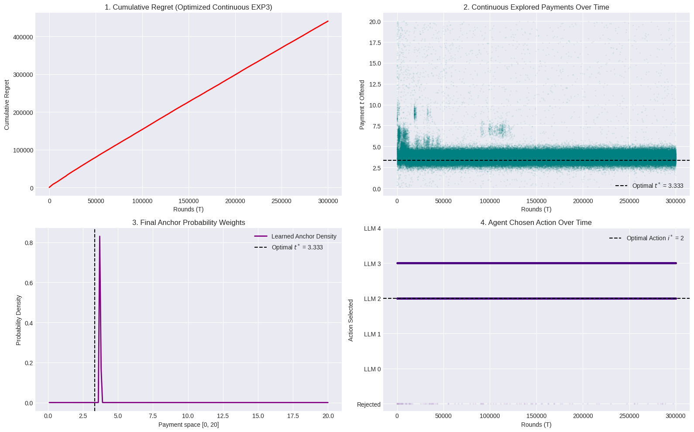
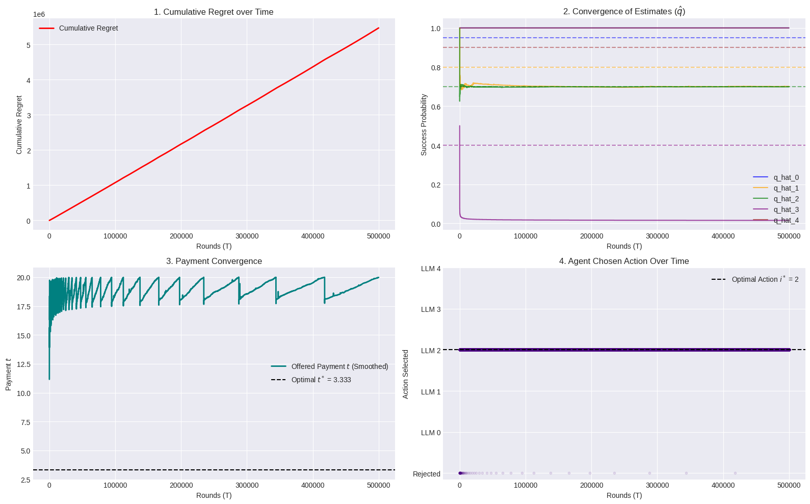
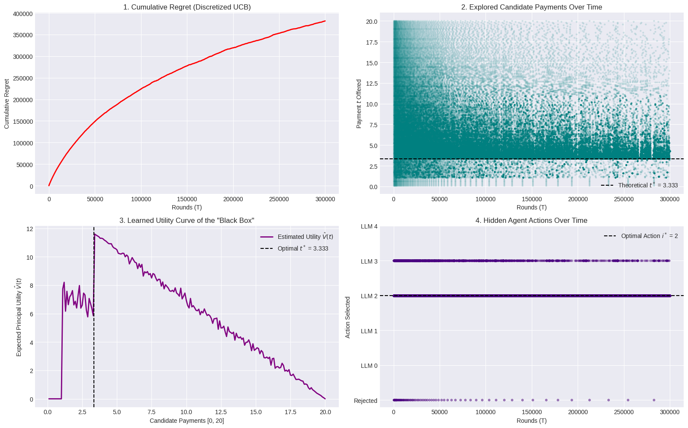

# Pricing for LLMs using Multi-Armed Bandit Algorithms

This repository contains the code and results for the CS499 project. The project explores the application of **Multi-Armed Bandit (MAB)** algorithms to solve complex **Principal-Agent problems** in the context of Large Language Models (LLMs). Specifically, the goal is to optimize the payment structure (contracts) to incentivize agents (LLMs) to perform tasks that maximize the principal's utility while learning the agent's hidden parameters over time.

---

## 📖 Problem Formulation

In this framework, we have a **Principal** and an **Agent** (which can be one of $K$ different LLMs or strategies).

*   **$R$**: The total fixed reward the Principal receives if the task is completed successfully.
*   **$t$**: The payment (contract) offered by the Principal to the Agent.
*   **$q_i$**: The hidden success probability of LLM $i$.
*   **$c_i$**: The cost incurred by LLM $i$ to execute the task.

### Utilities
*   **Agent's Utility ($U_a$)**: The agent acts to maximize its own expected utility: 
    $$U_a = q_i \cdot t - c_i$$
    The agent will only accept a contract if its utility is non-negative (Individual Rationality constraint, $U_a \ge 0$).
*   **Principal's Expected Utility ($U_p$)**: The principal wants to maximize its expected utility:
    $$U_p = q_i \cdot (R - t)$$

### The Challenge
The Principal does not have full information about the success probabilities ($q_i$) or the costs ($c_i$) of the LLMs. Therefore, the Principal must explore different payment amounts ($t$) over time, observing the binary success/failure outcomes to implicitly learn the optimal payment $t^*$ that induces the agent to select the optimal LLM $i^*$ that maximizes the Principal's utility.

---

## 🛠 Algorithms Implemented

To solve this pricing and exploration problem, this repository implements three different Multi-Armed Bandit strategies:

### 1. Continuous Kernelized EXP3 (`EXP3.py` & `EXP3_optimised.py`)
Because the payment $t$ is a continuous variable, standard discrete bandit algorithms fail. This approach adapts the adversarial **EXP3 (Exponential-weight algorithm for Exploration and Exploitation)** to a continuous action space.
*   It uses **Kernel Density Estimation (KDE)** to build a continuous probability distribution over the payment space $[0, R]$.
*   It balances uniform exploration with density-based exploitation.
*   `EXP3_optimised.py` provides a computationally optimized version of the same logic using PyTorch.

### 2. UCB on Success Probabilities (`UCB_on_q.py`)
This approach uses the **Upper Confidence Bound (UCB)** framework to maintain optimistic estimates of the success probabilities ($\hat{q}$).
*   In each round, the Principal calculates optimistic success probabilities for each LLM.
*   It explicitly calculates the optimal payment $t$ by satisfying the **Incentive Compatibility (IC)** and **Individual Rationality (IR)** constraints using the optimistic $\hat{q}$ estimates.

### 3. UCB on Payments (`UCB_on_t.py`)
Instead of estimating the underlying success probabilities, this variant directly applies the UCB exploration-exploitation mechanism over the payment space $t$.

---

## 📊 Results and Visualizations

The effectiveness of these algorithms is evaluated by plotting **Cumulative Regret**, the **Convergence of Payments**, and the **Frequency of Induced Actions**.

### 1. Continuous Kernelized EXP3 Results
The Continuous EXP3 algorithm successfully builds a probability density curve that peaks around the theoretical optimal payment $t^*$. Over time, the agent is incentivized to choose the optimal action.



*(Optimized version results)*


### 2. UCB on $q$ Results
The UCB algorithm explicitly converges its estimates $\hat{q}$ towards the true probabilities $q$. As the estimates converge, the offered payment $t$ smoothly converges to the optimal payment $t^*$, minimizing cumulative regret.



### 3. UCB on $t$ Results
Applying UCB on the payment space also yields convergence towards the theoretical optimal payment.



---

## 🚀 How to Run

### Requirements
The project uses Python and requires the following libraries. The EXP3 implementation supports PyTorch for GPU-accelerated array operations.
```bash
pip install torch numpy matplotlib scipy
```

### Execution
You can run any of the simulation scripts directly from the command line. For example:
```bash
python UCB_on_q.py
```
This will execute the learning loop and automatically render the Matplotlib plots shown above.

## 📁 Repository Contents

*   `CS499.pdf`: Project report and detailed mathematical formulation.
*   `EXP3.py` / `EXP3_optimised.py`: Continuous Adversarial Bandit implementations.
*   `UCB_on_q.py` / `UCB_on_t.py`: Stochastic Bandit implementations.
*   `*.png`: Saved graphical results.
